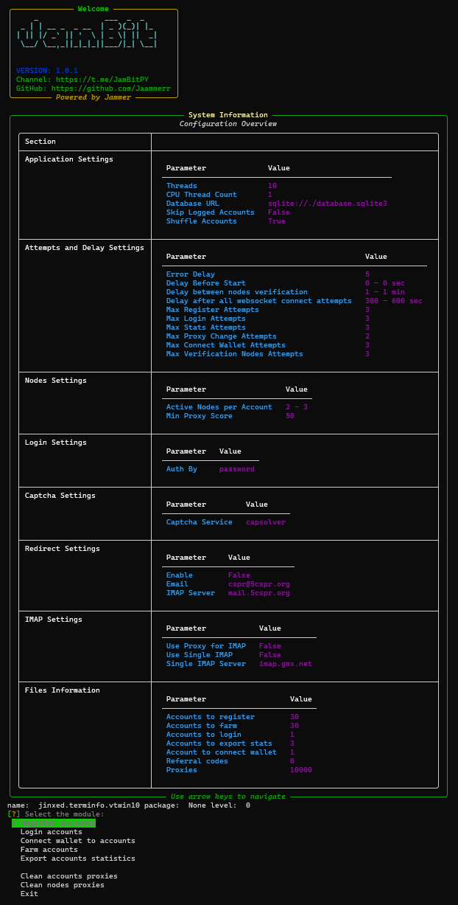

# 🌐 Grass Bot 1.25X [v1.0.1]

  

  

    
    
  

---

## 💸 Free to Use

**Grass Bot 1.25X** is completely free to use.  
No payments, no hidden fees — just download and start automating.

---

## 💻 OS Compatibility

  
  

---

## 📘 Guides

> 🛠 **[Installation Guide](https://jammers-organization.gitbook.io/jambit/depin/grass-1.25x/installation)**  
> 📖 **[User Guide – Getting Started](https://jammers-organization.gitbook.io/jambit/depin/grass-1.25x/user-guide-getting-started)**

Detailed step-by-step instructions to help you install and use **Grass Bot 1.25X** effectively.

---

## 🧩 Modules

- Register accounts  
- Login accounts  
- Farm accounts  
- Connect wallet to accounts  
- Export accounts statistics  
- Clean accounts proxies  
- Clean nodes proxies  

---
## 🔒 Code Availability

The source code of **Grass Bot 1.25X** is closed.

This decision is intentional — the system includes unique technical solutions that took a lot of time and effort to develop. Opening the code would lead to uncontrolled resale and misuse of the software, which i aim to avoid in order to maintain quality and integrity.

Thank you for understanding.
